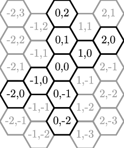
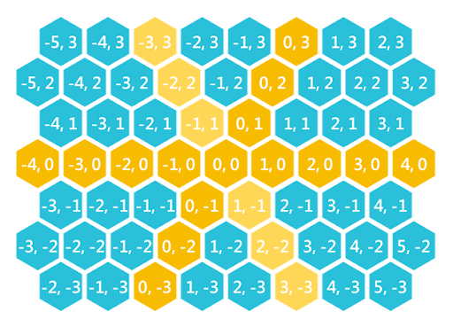

# HexTerrainPrototype
This project is a prototype for the procedural terrain generation in our new game.

The placeholder graphics are from this hex pack on itch.io: 
https://ratbyteboss.itch.io/free-hires-hex-tile-game-assets

This terrain generator can use both the Flat top and Pointy Top styles of hexagonal tile maps. The image's below show how the coordinates work in each relative to the origin tile (0,0,0).

**FLAT TOP HEX COORDS:** 

**POINTY TOP HEX COORDS:** 

